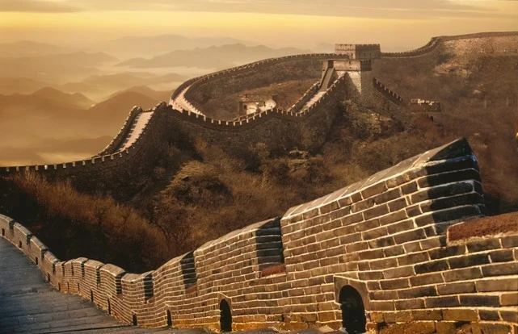

# 🔥 越过长城，走向世界

<figure><figcaption>
CGF.GITBOOK.IO
</figcaption></figure>

“Across the Great Wall we can reach every corner in the world.（越过长城，走向世界）”这是1987年9月20日从北京向海外发出的中国第一封电子邮件。这也预示着，互联网时代悄然叩响了中国的大门。
